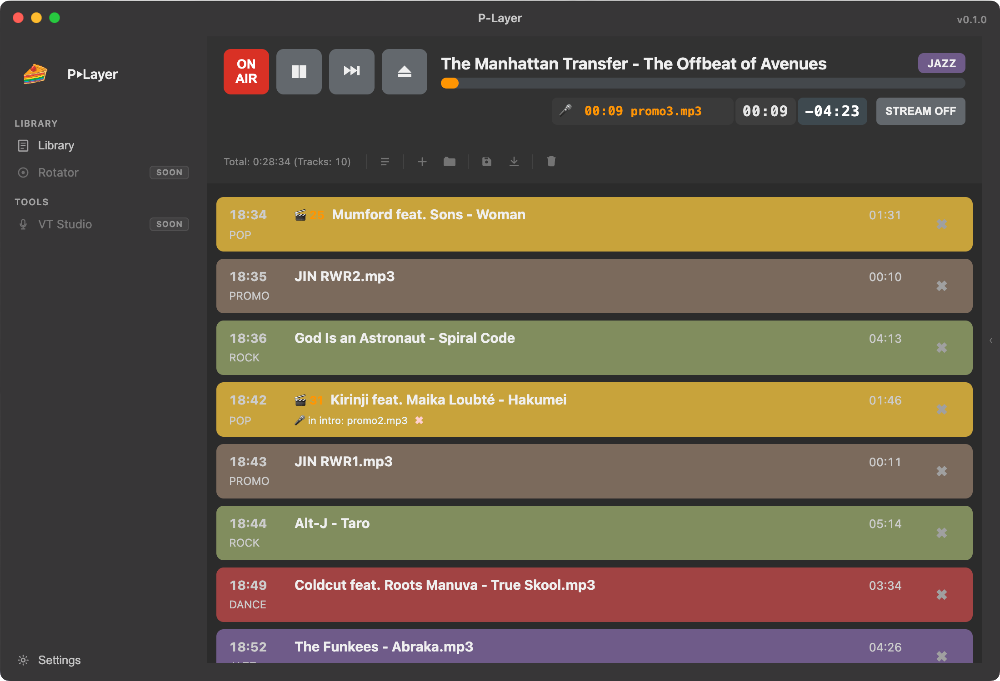
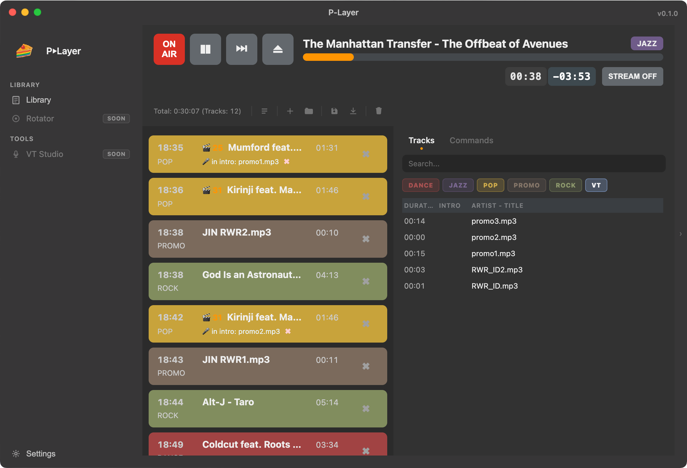
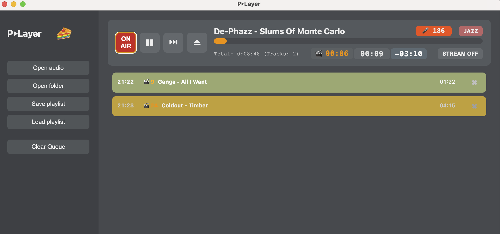

# P-Layer User Manual

P-Layer is a professional broadcast automation application designed for radio stations, community radio, and streamers. It provides precise playlist control, audio processing, scheduling, streaming (Icecast/Shoutcast), and integrated Voice Tracking.

---

## 1. Quick Start & Settings

Open Settings from the left sidebar before first use.

---

### General Tab

• Playlist Folder
Select the folder where scheduled playlists (.m3u) are stored.
Required for Scheduler.

• Crossfade Duration
Used only if a track has no Fade Out marker.

• Smart Crossfade

- Silence Threshold
- Silence Window
- Only in last (sec)

• Compressor Mode

- Off
- Soft
- Punchy (recommended for broadcast sound)

---

### Categories Tab (Required)

At least one category must be created for Library to function.

1. Enter Category Name
2. Choose Color
3. Select Folder with audio files
4. Confirm ✔

Files from that folder will appear in the Library.

Recommended structure:
One main music folder → subfolders per category.

---

### Voice Tracking (New)

Voice Tracking allows automatic voice-over playback inside track intros or transitions.

Configuration:

• In Categories settings, enable the checkbox:
  "Use for Voice Tracking"

Any track in a category marked as Voice Tracking is treated as a Voice Track (VT).

Voice Track Playback Logic:

When a Voice Track is placed between two music tracks:

1. If the next track has an Intro marker and its intro duration is greater than or equal to the Voice Track length →Voice Track plays entirely inside the next track's intro.
2. If the next track has an Intro marker but its intro is shorter than the Voice Track →Voice Track starts on the previous track’s tail so that it ends exactly at the end of the next track’s intro.
3. If the next track has no Intro marker (intro = 0) →
   Voice Track starts on the previous track’s tail and ends exactly at the beginning (0 point) of the next track.

All timing is calculated strictly by playback counters (elapsed / remaining).
No artificial delays are used.

Ducking:

• Music volume is automatically reduced during Voice Track playback.
• Music restores after Voice Track ends.
• Ducking depth and release time are configurable in Audio Processing settings.

---

### Streaming Tab

Configure Icecast or Shoutcast:

• Enable Streaming
• Host
• Port
• Mountpoint
• Password

STREAM button states:
• OFF
• CONNECTING
• ON
• ERROR

---

### Audio Processing & Ducking

• Master output normalization
• Automatic ducking during Voice Tracks
• Adjustable Ducking Amount
• Adjustable Release Time

---

## 2. Library & Playlist Management

### Library Panel

Right side panel:

• Files — categorized audio files
• Commands — automation commands

Real-time search available.

---

### Playlist Control

• Drag tracks from Library or Finder
• Reorder with drag & drop
• Remove with ✖
• Clear Playlist removes all items

Tracks added from Finder appear uncategorized unless matched by folder rules.

---

### Queue Timers & Indicators

• Queue Duration — total remaining time when stopped
• Air Time — calculated broadcast time per track

---

## 2.1 Track Markers (Audio Markup)

Markers are edited per track and saved in the Library.

---

### Intro Marker

Defines the end of the intro section.

Used for:
• Intro countdown display
• Voice Track timing

If present:
• Intro countdown appears in player
• Disappears automatically when intro ends

---

### Fade Out Marker

Defines the exact transition point.

• Next track starts precisely at this moment
• Crossfade duration is ignored
• No artificial fade-in

Fade Out is the primary transition mechanism.

---

### Marker Logic

• All markers are measured from real track start
• Timers and progress bars follow marker logic
• Voice Tracking respects marker-based timing

---

## 3. Automation Commands

Zero-duration playlist items:

• Start Stream
• Stop Stream

Behavior:
• Executes instantly
• Playback continues

Commands are saved in .m3u playlists.

---

## 4. Scheduler

Checks scheduled playlists every 10 seconds.

### Scheduling Format

Save playlist as:

YYYY-MM-DD_HH-MM.m3u

When system time matches — playlist loads automatically.

---

### Auto-Loading Behavior

• If playing → seamless transition
• If stopped → playlist loads and starts automatically

---

## 5. On-Air Control

• Play / Pause / Next / Eject
• STREAM button controls broadcast
• No silence gaps (internal keep-alive)

---

### Technical Notes

• Supported formats: MP3, WAV, FLAC, M4A
• Recommended sample rate: 44.1 kHz
• Incorrect sample rate shows warning ⚠️

Voice Tracking works entirely through playback counters and marker-based timing.

---

# Руководство пользователя P-Layer (RU)

P-Layer — профессиональная система автоматизации эфирного вещания для радио и стриминга. Поддерживает плейлисты, маркеры, стриминг и Voice Tracking.

---

## 1. Быстрый старт и настройки

Откройте Settings в левом меню.

---

### General (Общие)

• Playlist Folder — папка с расписанием
• Crossfade Duration — используется при отсутствии Fade Out
• Smart Crossfade — переход по тишине
• Compressor Mode — Off / Soft / Punchy

---

### Categories (Обязательно)

Создайте хотя бы одну категорию:

1. Имя
2. Цвет
3. Папка
4. Подтвердить ✔

---

### Voice Tracking (Новая функция)

Voice Tracking позволяет автоматически воспроизводить голосовые вставки (Voice Track) в интро или на стыке треков.

Настройка:

В категории включите чекбокс:
«Use for Voice Tracking»

Все треки этой категории будут считаться Voice Track.

Логика воспроизведения:

Если Voice Track стоит между двумя музыкальными треками:

1. Если интро следующего трека длиннее или равно Voice Track →Voice Track полностью проигрывается внутри интро следующего трека.
2. Если интро следующего трека короче Voice Track →Voice Track запускается на хвосте предыдущего трека и заканчивается в точке окончания интро следующего трека.
3. Если у следующего трека нет интро →
   Voice Track проигрывается на хвосте предыдущего трека и заканчивается в нуле следующего трека.

Все расчёты выполняются строго по счётчикам elapsed / remaining.

Дакинг:

• Музыка автоматически приглушается во время Voice Track
• После окончания голосовой вставки громкость восстанавливается

---

### Streaming

Настройка Icecast / Shoutcast.

---

### Обработка звука и дакинг

• Нормализация
• Дакинг под голос
• Настройки глубины и восстановления

---

## 2. Библиотека и плейлист

### Library

Правая панель:

• Files
• Commands

---

### Управление плейлистом

• Drag & drop
• Сортировка
• Удаление
• Очистка

---

### Таймеры

• Queue Duration
• Air Time

---

## 2.1 Маркеры

### Маркер Intro

Определяет конец вступления.
Используется для тайминга Voice Track.

---

### Маркер Fade Out

Определяет точку перехода.
Следующий трек стартует строго в этой точке.

---

### Логика

• Отсчёт от реального старта
• Таймеры следуют маркерам
• Voice Tracking учитывает интро и fade_out

---

## 3. Команды

• Start Stream
• Stop Stream

---

## 4. Планировщик

Проверка каждые 10 секунд.
Формат имени: YYYY-MM-DD_HH-MM.m3u

---

## 5. Управление эфиром

• Кнопки плеера
• STREAM
• Без пауз между элементами

---

Поддерживаемые форматы: MP3, WAV, FLAC, M4A
Рекомендуемая частота: 44.1 kHz
