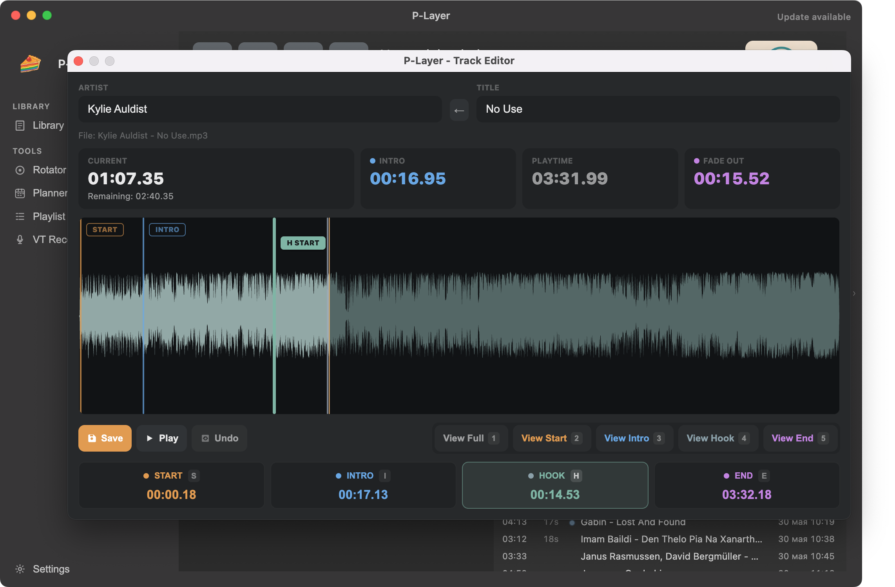

# P-Layer

P-Layer is a professional broadcast automation application designed for radio stations, community radio, and streamers. It provides precise playlist control, audio processing, scheduling, streaming (Icecast/Shoutcast), and integrated Voice Tracking.

---

## Key Features

- Broadcast automation and playlist control
- **Rotator** music scheduling system
- Automatic daily playlist generation (.m3u) from hourly clocks
- Visual hour editor (**Clock Wheel**)
- Artist / Track separation rules for music rotation
- Integrated **Voice Tracking**
- Audio processing and compression
- Icecast and Shoutcast streaming support
- Library synchronization with disk

---

---

## 1. What This App Does

P-Layer allows you to:

1. Run live playback from a queue (Studio).
2. Store and edit a categorized music library.
3. Mark up tracks in Audio Editor (Start / Intro / Fade Out).
4. Auto-load playlists by time.
5. Generate playlists in Rotator (PRO).
6. Plan break content in Planner.
7. Start/stop stream output (Icecast/Shoutcast) manually or by playlist commands.

---

## 2. Main Windows and Buttons

### Main Window (Studio)

Left sidebar:

1. `Library`
2. `Rotator`
3. `Planner`
4. `Playlist`
5. `Settings`

Top center:

1. Player controls (`Play`, `Pause`, `Next`, `Eject`)
2. `STREAM OFF/ON` button

Below:

1. Queue (track cards)
2. Queue toolbar buttons:
   - `Compact view`
   - `Open audio`
   - `Open folder`
   - `Save playlist`
   - `Load playlist`
   - `Clear queue`

Right side:

1. Library (`Tracks` / `Commands`)
2. Library search

---

## 3. First Launch: Setup Before Going On Air

## Step 1. Select Playlist Folder

1. Click `Settings` in the left sidebar.
2. Open the `General` tab.
3. In `Playlist Folder`, click `Select Folder`.
4. Choose your working `.m3u` folder.

Result:

1. This folder will be used for:
   - `Save playlist`
   - `Load playlist`
   - auto-loading scheduled playlists
   - Rotator generated files.

## Step 2. Create Categories

1. In `Settings`, open `Categories`.
2. In `Add New Category`, fill:
   - `Category Name`
   - color
   - `Category Path` via `Select Folder` (recommended)
3. Optional flags:
   - `Play Over` for voice tracks
   - `Non Music` for ad/news/service categories used in Planner.
4. Click `Add`.

Result:

1. Category appears in categories list.
2. Tracks from that folder appear in Library.

## Step 3. Configure Audio Outputs

1. In `Settings -> General`, find `Audio Output Routing`.
2. Set:
   - `Program Output Device` (main on-air output)
   - `Preview Output Device` (Audio Editor preview output)

Result:

1. Studio player uses Program output.
2. Audio Editor uses Preview output.
3. If Preview is not selected or disappears, preview falls back to Program output.

## Step 4. Configure Streaming (if needed)

1. `Settings -> Streaming`.
2. Enable `Enable streaming`.
3. Fill:
   - `Server type`
   - `Host`
   - `Port`
   - `Mountpoint / Stream ID`
   - `Username`
   - `Password`
   - `Bitrate`

Result:

1. `STREAM` button in Studio can start real stream output.

## Step 5. Exit Settings

1. Click `Back` at the bottom of the settings view (above Support block).

Result:

1. You return to the main Studio screen.

---

## 4. Working with Library

## Where to View Tracks

1. Right panel `Library`.
2. `Tracks` tab: audio tracks by categories.
3. `Commands` tab: `Start Stream` and `Stop Stream`.

## What You Can Do in Library

1. Drag tracks into queue.
2. Double-click a library track to open Audio Editor.
3. Right-click a track -> `Edit Markers`.
4. Use `Search`.

## Library Hints

1. If artist is empty or title looks like raw filename with extension, row is dimmed.
2. `⚠️` icon means non-standard sample rate (not 44.1 kHz).

---

## 5. Studio Queue: Basic Workflow

## Add Tracks

1. Drag tracks from `Library -> Tracks` into queue.
2. Or click `Open audio` and select a file.
3. Or click `Open folder` to add all supported files from a folder.

Supported formats: `mp3`, `wav`, `flac`, `m4a` (drag&drop also supports `ogg`).

## Reorder

1. Drag queue cards to new positions.

## Remove

1. `x` on card removes one item.
2. `Clear queue` clears entire queue.

## Compact View

1. Click `Compact view` to toggle compact queue cards.

## Edit Track from Queue

1. Double-click track card -> Audio Editor.
2. Or right-click -> `Edit Markers`.

Result:

1. After `Save` in Audio Editor, queue card updates marker/title data without full queue rerender.

---

## 6. Audio Editor: How to Mark a Track

## How to Open

1. From queue: double-click track card.
2. From library: double-click track row.
3. From context menu: `Edit Markers`.

## Marker Meanings

1. `Start` — playback start point inside file.
2. `Intro` — intro end point.
3. `Fade Out` — exact point where next track should start.

## Basic Marking Scenario

1. Start playback with `Play`.
2. At required position, click `Start`.
3. At intro end, click `Intro`.
4. At transition point, click `Fade`.
5. Fine-adjust with `←/→` (50 ms step).
6. Click `Save`.

Result:

1. Markers are saved to library DB.
2. Audio Editor closes automatically after successful `Save`.
3. Queue/now-playing data in Studio is updated.

## Useful Buttons

1. `Undo`
2. `Zoom -> Start`
3. `Show Full`
4. `Zoom -> End`
5. `Zoom` slider

---

## 7. On-Air Playback and Streaming

## Player Controls

1. `Play` — start queue playback.
2. `Pause` — pause.
3. `Next` — skip to next queue item.
4. `Eject` — stop/reset playback.

## Streaming Control

1. `STREAM OFF` button:
   - click -> connect to server
   - statuses: `CONNECTING`, `STREAM ON`, `STREAM ERROR`, `STREAM OFF`

Important:

1. If `Enable streaming` is disabled in `Settings -> Streaming`, button shows `DISABLED`.

## Playlist Commands

1. In `Library -> Commands`, available:
   - `Start Stream`
   - `Stop Stream`
2. Drag these commands into queue/playlist.

Result:

1. During playback, command executes automatically.

---

## 8. Save/Load Playlists and Time-Based Auto-Load

## Manual Save

1. In Studio click `Save playlist`.
2. Save `.m3u` file to desired folder.

## Manual Load

1. Click `Load playlist`.
2. Select `.m3u`.

Result:

1. If playback is active, load is seamless (transition to new playlist).
2. If stopped, playlist loads and starts playback immediately.

## Auto-Load by Time (Scheduler)

How it works:

1. App checks every 10 seconds for a file matching current minute.
2. Filename format must be exact: `YYYY-MM-DD_HH-MM.m3u`.

Example:

1. `2026-03-28_14-30.m3u`

Result:

1. At `14:30` this playlist auto-loads.

---

## 9. Playlist Editor (Separate Window)

## How to Open

1. Click `Playlist` in Studio left menu.
2. Or double-click row in `Rotator -> Schedule -> Generated Playlists`.

## What You Can Do

1. Build playlist via drag&drop from Library.
2. Reorder items.
3. Add `Start/Stop Stream` commands.
4. See total time and cumulative card timing.
5. Use `Load playlist`, `Save playlist`, `Clear playlist`.
6. Use `Compact view`.

## Break Marker Behavior

1. If playlist contains `[BREAK:N]`, it is shown as `Break N` card.
2. Break card is visible but not editable as regular track (does not open Track Editor).
3. Drag-reorder and delete are still available.

---

## 10. Rotator (Schedule Generator)

Open with `Rotator` button in Studio.

Rotator has 3 tabs:

1. `Clock Editor`
2. `Categories`
3. `Schedule`

## 10.1 Clock Editor

Goal:

1. Build hour template (clock) from categories and break markers.

How to create a clock:

1. Enter name in `CLOCK NAME`.
2. Drag categories from right `CATEGORIES` panel into `CLOCK SLOTS`.
3. Add break slots from `BREAKS` panel if needed.
4. Reorder slots with drag&drop.
5. Click `Save`.

Result:

1. Clock is saved and available in Schedule generation.

Extra actions:

1. `New` — new unsaved draft.
2. `Delete` — delete selected clock.
3. In `BREAKS`, you can set custom names for Break1..Break5.

## 10.2 Categories

This tab sets rotation rules:

1. Per category: `TRACK SEPARATION MIN`.
2. Global: `ARTIST SEPARATION (MIN)`.

If set to `0`, restriction is disabled.

## 10.3 Schedule

Goal:

1. Generate `.m3u` files into playlist folder.

Steps:

1. Select `CLOCK TEMPLATE`.
2. Select `DATE`.
3. Select `HOURS` mode:
   - `All 24 hours`
   - `Selected hours`
   - `Standalone playlist`
4. Click `Generate`.

Result:

1. Files appear in `Generated Playlists`.
2. `Last Generation Details` shows warnings/details.

In `Generated Playlists`:

1. Double-click row -> open file in Playlist Editor.
2. Click `x` in row -> delete file from disk.

## PRO in Rotator

Rotator generation requires PRO.

Activation:

1. Click `PRO` badge (top-right in Rotator).
2. Copy `LICENSE REQUEST CODE` via `Copy`.
3. Obtain your license key.
4. Paste into `LICENSE KEY`.
5. Click `Activate`.

---

## 11. Planner (Break Planning)

Open with `Planner` button in Studio.

Planner is available in free version, but break content fill in runtime playback requires PRO.

## Planner Layout

Left side:

1. `Planner Grid` (Break1..Break5 x 24 hours)
2. `Break Editor` (selected slot content)

Right side:

1. Library filtered to categories with `Non Music` flag.

## How to Fill a Slot

1. Select date (`Date`, `Today`, `Copy Prev Day`).
2. Click a track in right library (it becomes selected).
3. Click target cell in grid (hour + break).

Result:

1. Track is added to that slot.
2. Item appears in `Break Editor -> Planned Items`.

## Change Order Inside Slot

1. In `Break Editor`, use:
   - `↑`
   - `↓`

Result:

1. Order is saved in DB and used in break playback.

## Remove Items

1. `x` next to item to remove one.
2. `Clear Slot` to remove all items from selected slot.

## Day Actions

1. `Copy Prev Day` — copy full previous day plan to selected date.
2. `Clear Day` — clear all slots for selected date.

## PRO in Planner

Activation flow is the same as Rotator:

1. Click `PRO`.
2. `LICENSE REQUEST CODE` -> `Copy`.
3. Paste `LICENSE KEY`.
4. Click `Activate`.

After activation, break cards in Studio refresh without app restart.

---

## 12. Break Markers in Playlist and Playback

Marker format:

1. `[BREAK:N]`, where `N = 1..5`.

Where markers come from:

1. Rotator inserts markers into generated playlists.
2. Studio and Playlist Editor parse them safely as break items (not file paths).

## How It Looks in Studio

Queue shows dedicated break card:

1. `Break N`
2. subtitle `Planner block` or `PRO license required to fill break`
3. spot count
4. total duration

## Playback Logic

1. Empty break -> skipped.
2. Non-empty break -> plays items planned in Planner for:
   - current date
   - current hour
   - matching BreakN.

Important:

1. Smart silence-based crossfade is not applied to tracks played inside break sessions.

---

## 13. Voice Track (Play Over)

How to enable:

1. `Settings -> Categories`.
2. Enable `Play Over` flag on desired category.

What this gives:

1. Tracks in this category become voice tracks.
2. You can attach them to music cards.

How to attach:

1. Drag voice track onto a music track card in queue.

Result:

1. Card shows `🎤` badge.
2. Voice track plays in intro or in-out depending on markers.

How to detach:

1. Click `✖` in voice badge on card.

---

## 14. Practical Scenario: Prepare a Broadcast Day

1. In `Settings`, verify `Playlist Folder`, `Streaming`, audio outputs.
2. In `Rotator -> Clock Editor`, build/review clock template.
3. In `Rotator -> Categories`, set separation rules.
4. In `Rotator -> Schedule`, generate playlists for target date.
5. In `Planner`, fill required break slots for that date.
6. In Studio, load specific file manually (`Load playlist`) if needed, or rely on scheduled auto-load.
7. Before going live, switch `STREAM` on.

---

## 15. Common Issues and Quick Fixes

## Playlist Did Not Auto-Load

Check:

1. `Settings -> General` has correct `Playlist Folder`.
2. Filename is exact `YYYY-MM-DD_HH-MM.m3u`.
3. System time is correct.

## Planner Right Panel Has No Tracks

Reason:

1. No categories with `Non Music` enabled.

Fix:

1. Enable `Non Music` on required categories in `Settings -> Categories`.

## Break Card Shows “PRO license required to fill break”

Reason:

1. PRO is not activated.

Fix:

1. Activate PRO via `PRO` in Planner or Rotator.

## Rotator Generation Fails

Check:

1. PRO license is active.
2. Clock template is selected.
3. Date is selected.
4. In `Selected hours` mode, at least one hour is selected.
5. `Playlist Folder` is configured.

## Double-Click on Generated Playlist Does Not Open

Reason:

1. File was deleted outside the app.

Fix:

1. Refresh list (focus Rotator window again, or generate again).
2. Re-generate missing file.

---

## 16. Pre-Broadcast Checklist

1. `Settings -> General`: Program output verified.
2. `Settings -> Streaming`: `Enable streaming` on, credentials filled.
3. `Rotator` (if used): schedules for target date are generated.
4. `Planner` (if breaks used): break slots are filled.
5. In Studio, correct queue/playlist is loaded.
6. `Play` starts successfully.
7. `STREAM` status is `ON`.

---

If you want, next step can be a one-page “Quick Start for Operators” version of this manual.
